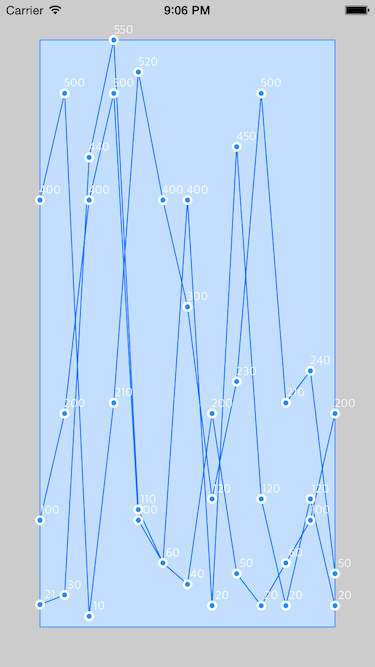

# JSGraphKit
Lightweight Graphing Library using CoreGraphics.

<h2>How it works</h2>
The library currently consists of two views, JSScatterPlot and JSBarPlot, both of which are subclasses of JSPlot. It's up to the developer to set the paddings of the graphs and data. The API makes it simple and there are default themes to use. Also, the graphs adjust according to its bounds, making porting the library to your project easy and simply by just setting the frame and feeding it data.

Please feel free to check out the header files of JSPlot, JSScatterPlot, JSBarPlot, to see all the properties and delegate/datasource methods you can set to make your graph elegant and responsive!

Also, if anyone has any suggestions, please feel free to send me an email or whatever.

<h3>Things to further implement</h3>
- Animating data on the view (e.g animate bars progressing up from 0, drawing the scatter plot points sequentially then connecting them after there drawn)
<h4>You can now animate the line graph</h4>
It defaults to 0.0f (no animation), so just specify the duration when initializing the scatter plot object. It doesn't work 100%, it overlaps the data points (it shouldn't) and there more animation functionality to work on.
```Objective-C
[self.scatterPlot setLineAnimationDuration:5.0f];
```
- Showing line curvature with scatter plot lines.
<h4>Now you can add curves!</h4>
You can now set a property within the scatter plot object to YES and wallah! You have curvy lines. There are some issues with it, but if you have fluxuating data points (multiple values that increase and decrease) it will look nice. But if you have, lets say 3 points that are descending, it wont look good. Working on fixing this issue. So this feature is in beta I guess.
```Objective-C
[self.scatterPlot setShowLineCurvature:YES];
```
- More to come!

<h3>Example</h3>

Lets start making the graph! So, just to basically setup the graph, we need data! We'll use some generic points, doesnt really matter if there floats or ints, they just need to be casted as NSNumbers in the end :).

```Objective-C
- (void)viewDidLoad {
    self.dataset1 = @[@100, @200, @400, @500, @100, @60, @40, @200, @50, @20, @60, @100, @200];
    self.dataset2 = @[@21, @30, @440, @550, @110, @60, @400, @20, @450, @120, @20, @120, @20];
    self.dataset3 = @[@400, @500, @10, @210, @520, @400, @300, @120, @230, @500, @210, @240, @50];

    self.scatterPlot = [[JSScatterPlot alloc] initWithFrame:self.view.frame];
    [self.scatterPlot setDataSource:self];
    [self.scatterPlot setDelegate:self];
    [self.view addSubview:self.scatterPlot];
}

- (NSNumber *)graphViewDataPointsAtIndex:(NSInteger)index forSetNumber:(NSInteger)setNumber
{
    switch (setNumber) {
        case 0:
            return [self.dataset1 objectAtIndex:index];
            break;
        case 1:
            return [self.dataset2 objectAtIndex:index];
            break;
        case 2:
            return [self.dataset3 objectAtIndex:index];
            break;
        default:
            break;
    }
    return nil;
}

- (NSInteger)numberOfDataPointsForSet:(NSInteger)setNumber
{
    switch (setNumber) {
        case 0:
            return [self.dataset1 count];
            break;
        case 1:
            return [self.dataset2 count];
            break;
        case 2:
            return [self.dataset3 count];
            break;
        default:
            break;
    }
    return 0;
}
- (NSInteger)numberOfDataSets
{
    return 3;
}
```
So here, we specify how many 'lines' we want to create. We then specify the amount of data points for each 'line' as well as supply the data point. 

Heres the result...


Eww... Not the best layout. Maybe I should change the default theme :P. But first, the graph seems to not show the min/max x points as well as min/max y points, or at least there cut off. So lets fix that. Here we set the padding of the graph view.

```Objective-C
    [self.scatterPlot setOverallPadding:40.0f];
```
Simple huh? Now lets see what we got.


Nice! Now we can actually see all the data.

Okay now lets set some themes, lets go with the Sky theme (my favorite)

```Objective-C
    [self.scatterPlot setTheme:JSGraphThemeSky];
```
Heres what we get...



Oh nice! Im likin it so far. But theres still some stuff missing :/. Lets add some horizontal lines! There is a datasource protocol you can implement to do this. Just set the number of lines you want and the library does the rest. By default, the horizontal and vertical axis aren't drawn. To show them, set the properties to yes. But when you set these to show, you need to implement the data source! Otherwise you will crash and receive an Assert message I implemented.

```Objective-C
    [self.scatterPlot setShowHorizontalAxis:YES];
    //[self.scatterPlot setShowVerticalAxis:YES];

- (NSInteger)numberOfHorizontalAxes
{
    return 10;
}
```

Lets see what this does...


Nice! We have lines! The Vertical Axis is in development now. You can use them but I advise you to wait or contribute! 

So now lets make these multiple data sets distinct between eachother with colors! So there is another datasource protocol you need to implement for this to occur. Here is the example.

```Objective-C
- (UIColor *)colorForPlotSet:(NSInteger)setNumber
{
    switch (setNumber) {
        case 0:
            return [UIColor redColor];
            break;
        case 1:
            return [UIColor blueColor];
            break;
        case 2:
            return [UIColor greenColor];
            break;
        default:
            break;
    }
    return nil;
}
```

Heres the result...


Cool, we can distinguish between the data now!

You can also 'do stuff' when a point is tapped. Just set your controller as the delegate and respond to the callbacks. Here is the example:

```Objective-C
- (void)JSPlot:(JSPlot *)graphView didTapDataPointAtIndex:(NSInteger)index inSet:(NSInteger)setNumber
{
    switch (setNumber) {
        case 0:
            NSLog(@"Did tap data point: '%@'", [self.dataset1 objectAtIndex:index]);
            break;
        case 1:
            NSLog(@"Did tap data point: '%@'", [self.dataset2 objectAtIndex:index]);
            break;
        case 2:
            NSLog(@"Did tap data point: '%@'", [self.dataset3 objectAtIndex:index]);
            break;
        default:
            break;
    }
}
```


<br><br>
<h2>Requirements</h2>
- iOS 7 or higher
- Automatic Reference Counting (ARC)
<br><br>

<h2>Author</h2>
- [John Setting](http://github.com/jsetting32) ([Facebook](https://www.facebook.com/jsetting23))
<br><br>

<h2>License</h2>
JSGraphKit is released under the MIT license. See the LICENSE file for more info.
